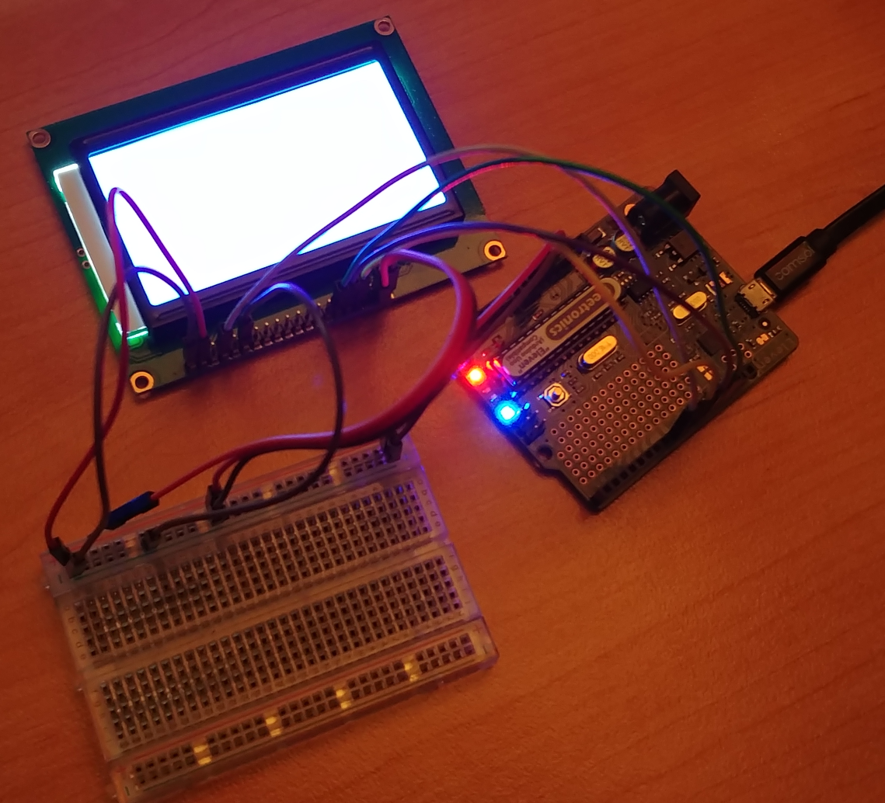
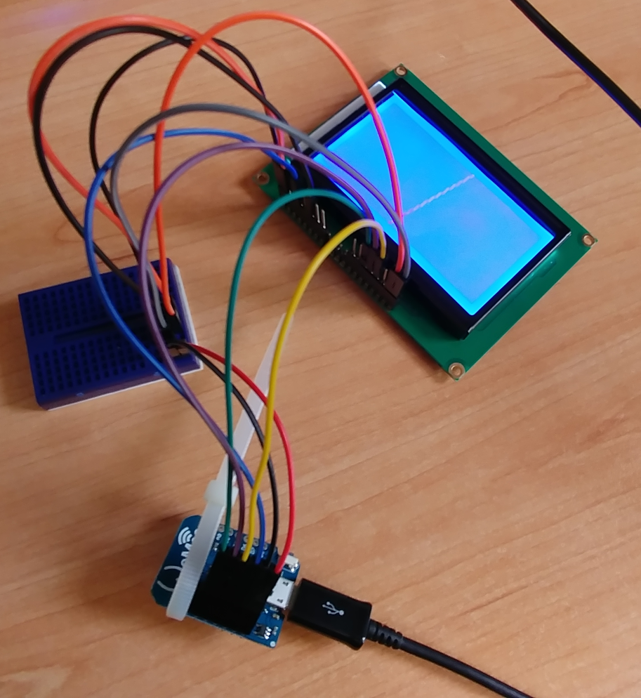

# ST7920-chipset LCD with Arduino test

This is a proof of concept for controlling an LCD dot matrix with an Arduino. The screen displays a spinning line. The wiring is quite neat and the code, when properly abstracted, will be easy to work with.

## Hardware

* 128 x 64 LCD dot matrix display, with ST7920 chipset
* Arduino board (Arduino Uno and Wemos D1 Mini were tested and are provided as examples)

Any 128 x 64 LCD that uses the ST7920 chipset should work interchangably with this code, and similar chipsets may work equally well if the constructor is modified accordingly.

## Wiring

The wiring of the numerical pins (`E`, `R/W`, `RS`, `RST`) can be connected to whichever GPIO pins you wish - just change the pin definitions to match your setup. The ones provided here are (tested and recommended) examples. Obviously, the LCD pins that go to `+5V`/`GND` must go to those places.

LCD      | Uno   | D1 Mini
---      | ---   | ---
`1  GND` | `GND` | `GND`
`2  VCC` | `+5V` | `+5V`
`4  RS`  | `10`  | `0` (labelled `D3`)
`5  R/W` | `11`  | `4` (labelled `D2`)
`6  E`   | `13`  | `5` (labelled `D1`)
`15 PSB` | `GND` | `GND`
`17 RST` | `8`   | `2` (labelled `D4`)
`19 BLA` | `+5V` | `+5V`
`20 BLK` | `GND` | `GND`

## Software

This code uses the [u8g2 library](https://github.com/olikraus/u8g2). This needs to be installed for the code to run. To install it, open the Arduino IDE, and navigate to `Sketch > Include Library > Manage Libraries...`, then search for "u8g2" and install it.

These pages from the u8g2 documentation will likely be useful to varying degrees:

* [Introduction to the library](https://github.com/olikraus/u8g2/wiki/setup_tutorial)
* [Constructor reference for ST7920](https://github.com/olikraus/u8g2/wiki/u8g2setupcpp#st7920-128x64)
* [u8g2 drawing api reference](https://github.com/olikraus/u8g2/wiki/u8g2reference)

## To Do

* Replace absolute coordinates with values relative to screen size

## Pictures

### Arduino Uno

### Wemos D1 Mini

